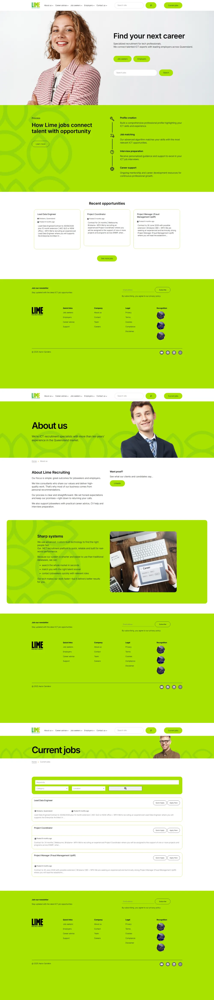
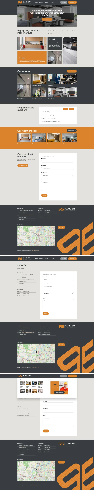
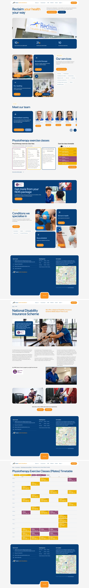

<section>
    

    

        

        

            

            

                
                
            

            

            

            

                
                
            

            

            

            

                
                
            

            

        

        

    

    

</section>

<section class="contact-section">
  

    

      

      
Contact

      <h2>Reach out today</h2>
      

      

      
      

    

  

</section>
